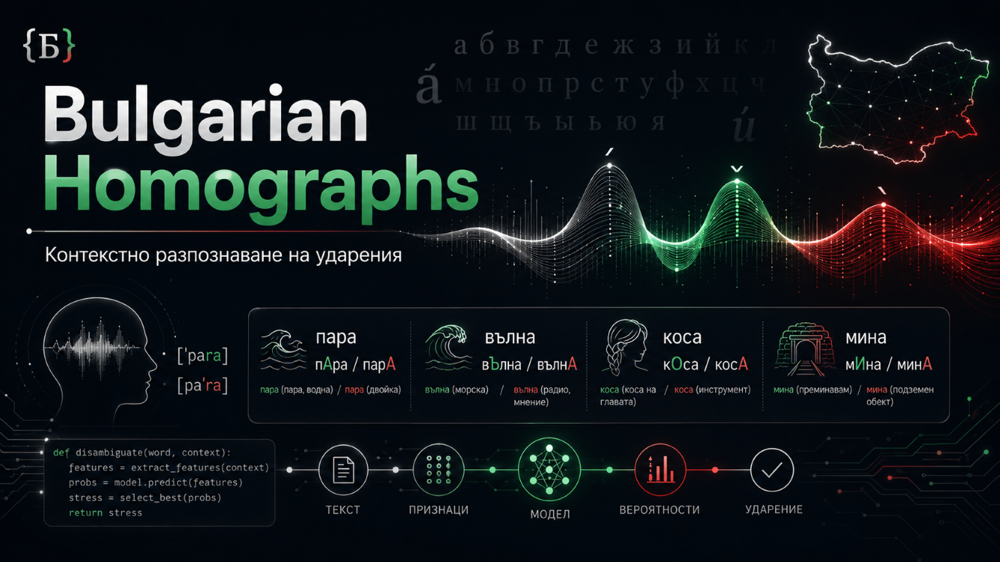

# Bulgarian Homographs

Експериментален инструмент за автоматичен избор на правилната ударена форма на български омографи в чист текст.

## Какво прави проектът

Проектът се опитва да разпознава думи, които се пишат еднакво, но имат различно ударение и различно значение.

Примери:

* `пара` - водна пара / парична единица
* `вълна` - морска вълна / материал
* `коса` - човешка коса / земеделски инструмент
* `мина` - мина като обект / мина като глаголна форма

Целта е програмата да избере правилния вариант според контекста на изречението.

## Как работи

Алгоритъмът използва речник с ударени форми и тества възможните варианти на омографите в изречението.

След това оценява кой вариант запазва най-добре ритъма на текста. Идеята е близка до просодичен анализ: ако бъде избрана неподходяща ударена форма, ритъмът на изречението се нарушава.

Проектът е разработван с помощта на Gemini, но самото разпознаване не използва невронен модел или външен AI API. Работата се базира на речник, правила и ритмична оценка.

## Текущ статус

Проектът е тестов и не е готов за реална употреба без допълнителни проверки.

В момента има следните ограничения:

* не обработва надеждно числа
* не обработва надеждно собствени имена
* разчита на наличните думи в речника
* при по-дълги изречения броят възможни комбинации може да стане много голям
* точността все още не е измерена върху официален тестов корпус

## Данни

Проектът използва речник с над 900 000 ударени думи, сред които около 9 700 омографа с техните възможни форми.

Произходът на речника, лицензът на данните и начинът на генериране трябва да бъдат описани в отделна секция или файл, например:

* `DATA_SOURCES.md`
* `DATA_LICENSE.md`
* `NOTICE.md`

Това е важно, за да е ясно откъде идват езиковите ресурси и при какви условия могат да се използват или разпространяват.

## Възможна употреба

Такъв инструмент може да бъде полезен като част от по-голям български TTS/G2P работен процес.

Например:

1. Първо се изгражда лексикон с ударения, IPA и омографни форми.
2. След това при обработка на суров текст този проект избира правилната ударена форма според контекста.
3. Накрая текстът се подава към G2P или TTS система.

## Връзка с други проекти

Този проект не е същият тип инструмент като лексиконен builder.

Например `bg_g2p_builder` е насочен към изграждане и нормализиране на езикови ресурси: лексикон, IPA, ударения и омографни таблици.

`Bulgarian_homographs` е по-скоро контекстен разпознавател, който се опитва да избере правилния запис от вече налични речникови ресурси.

Двата подхода могат да се допълват, но се използват на различни етапи.
